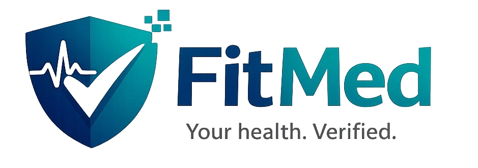

# FitMed — Digital Medical Fitness Certification Platform

> **Fit, Verified, and Ready.**  
> Secure digital medical fitness assessments conducted and certified by licensed doctors.



---

## Table of Contents

1. [Overview](#overview)
2. [Core Concept](#core-concept)
3. [Brand & Design](#brand--design)
4. [Applicant Journey](#applicant-journey)
5. [Certificate Categories](#certificate-categories)
6. [Health Assessment](#health-assessment)
7. [Measurements, AI & Wearables](#measurements-ai--wearables)
8. [Doctor Dashboard](#doctor-dashboard)
9. [Virtual Clinical Assessment](#virtual-clinical-assessment)
10. [Doctor Decision Framework](#doctor-decision-framework)
11. [Electronic Medical Fitness Certificate](#electronic-medical-fitness-certificate)
12. [QR Verification System](#qr-verification-system)
13. [Employer / Organisation Portal](#employer--organisation-portal)
14. [AI Role and Safety](#ai-role-and-safety)
15. [Doctor Verification & Quality Control](#doctor-verification--quality-control)
16. [Administration Dashboard](#administration-dashboard)
17. [Payment Model](#payment-model)
18. [Fitness Rules Engine](#fitness-rules-engine)
19. [Platform Architecture](#platform-architecture)
20. [Recommended MVP](#recommended-mvp)
21. [Product Roadmap](#product-roadmap)
22. [Privacy, Security & Regulatory](#privacy-security--regulatory)
23. [Strategic Positioning](#strategic-positioning)
24. [Relationship with MediConnect](#relationship-with-mediconnect)
25. [Tech Stack](#tech-stack)
26. [Getting Started](#getting-started)
27. [Project Structure](#project-structure)

---

## Overview

**FitMed** is a digital medical fitness certification service that allows individuals or organisations to request a medical fitness assessment entirely online. Applicants create an account, select the purpose of their certificate, complete a structured health questionnaire, provide relevant measurements, and then undergo a secure video consultation with a licensed doctor.

The doctor reviews the application, verifies the applicant's identity, performs an appropriate remote clinical assessment, determines whether the applicant is fit for the stated purpose, and issues a digitally signed electronic certificate when appropriate.

**Key differentiator:** AI and automated measurements remain decision-support tools only. The final medical fitness decision is always made by an appropriately licensed doctor.

---

## Core Concept

> *"A secure digital medical fitness assessment conducted by a licensed doctor."*

The platform is positioned as a **secure digital medical fitness assessment**, not an automated certificate generator. Fitness is purpose-specific — a person may be fit for an office role but not fit for a high-risk occupation such as working at heights or operating heavy machinery. The platform therefore requires the applicant to specify the **purpose** of the certificate before assessment.

---

## Brand & Design

| Element           | Value |
|-------------------|-------|
| **Brand name**    | FitMed |
| **Descriptor**    | Digital Medical Fitness Certification |
| **Tagline**       | *Fit, Verified, and Ready.* |
| **Alternative**   | MedClear — *Medical clearance, made simple.* |
| **Logo concept**  | Modern medical shield + check mark, optional ECG line, digital identity element |
| **Primary colour**| Deep navy / sky blue — trust, professionalism, security |
| **Secondary**     | Teal / green — health, wellness, positive clearance |
| **Success**       | Green — Fit / cleared |
| **Warning**       | Amber — Further review / caution |
| **Danger**        | Red — Not cleared |

**Fonts:** Plus Jakarta Sans (headings) · DM Sans (body)

---

## Applicant Journey

1. Create an account and verify phone / email
2. Provide identity and demographic information
3. Select **Request Medical Fitness Certificate**
4. Choose the reason / purpose for the certificate
5. Complete an adaptive medical history questionnaire
6. Complete danger-sign and symptom screening
7. Provide height, weight, and available vital signs
8. Optionally connect validated wearable or Bluetooth devices
9. Submit the application
10. A licensed doctor reviews the application
11. The doctor initiates a secure live video consultation
12. The doctor verifies the applicant's identity
13. The doctor completes history-taking and an appropriate virtual assessment
14. The doctor decides: **Fit** | **Fit with Restrictions** | **Further Assessment Required** | **Not Fit**
15. If appropriate, the doctor digitally signs and issues the certificate
16. The applicant receives the certificate and QR verification code
17. An employer or authorised organisation can verify the certificate without accessing unnecessary medical information

---

## Certificate Categories

### Potentially Telemedicine-Eligible
- Basic employment or administrative fitness assessments where permitted
- Some school or university fitness certificates
- Some general fitness assessments
- Other low-risk categories approved under applicable clinical and regulatory frameworks

### Categories Requiring Additional Doctor Review
- Significant medical history
- Abnormal vital signs
- Concerning symptoms or danger signs
- Abnormal or inconsistent device measurements
- Relevant medications or previous hospitalisation
- Any situation where the doctor considers the information insufficient

### Physical Examination Required
- Certain heavy-machinery occupations
- Certain work-at-height roles
- Certain transport / driving assessments
- Armed / security roles where regulated
- Aviation-related assessments
- Diving or other specialised high-risk occupations
- Any category for which applicable Rwandan law, occupational-health standards, or licensing rules require an in-person examination

> **Important:** Excluded/high-risk categories are determined from applicable Rwandan medical, occupational-health, licensing, privacy, and telemedicine requirements — not hard-coded from business assumptions.

---

## Health Assessment

### Demographic & Identity Information
Full name · Date of birth · Sex · Phone · Email · Address · National ID or passport · Emergency contact · Required consent declarations

### Medical History
Previous illnesses · Hypertension · Diabetes · Cardiovascular disease · Asthma/COPD · Epilepsy/seizures · Mental health history · Previous surgery · Hospitalisation · Current medications · Allergies · Family history · Smoking · Alcohol/substance use (where clinically relevant) · Pregnancy status (where clinically relevant)

The questionnaire is **adaptive** — applicants are not forced to answer irrelevant questions. Positive responses trigger targeted follow-up questions.

### Danger-Sign Screening
Chest pain · Severe shortness of breath · Syncope or near-syncope · Severe headache · New neurological deficits · Severe abdominal pain · Active bleeding · Seizures · Severe allergic reaction · Altered mental status · Purpose-specific red flags

A serious red flag interrupts the certificate pathway and triggers an appropriate medical-care recommendation or clinician review — never automatic certification.

---

## Measurements, AI & Wearables

### Applicant Measurements
Height · Weight · BMI · Temperature · Heart rate · Blood pressure · Respiratory rate · SpO₂

### AI-Assisted Measurements
Smartphone camera / computer-vision or remote-PPG technologies may be used to estimate selected physiological parameters. Such outputs are clearly labelled as **AI-estimated or screening measurements** unless the specific technology has appropriate validation for clinical use.

The interface distinguishes among:
- Applicant-reported measurements
- Device-measured values
- AI-estimated values

### Wearable & Device Integration
Apple Health · Google Health Connect · Fitbit · Garmin · Samsung Health · Bluetooth blood-pressure monitors · Bluetooth pulse oximeters · Smart scales · Other validated devices

The platform displays the source, timestamp, and measurement type so the doctor can judge reliability.

---

## Doctor Dashboard

The doctor dashboard is the core clinical workspace.

### Applicant Overview
Applicant identity & verification status · Certificate purpose · Risk level / screening status · Medical history summary · Current medications & allergies · Vital signs & source · BMI · Red flags · Previous certificates · Relevant supporting documents

### Consultation Features
Secure live video consultation · Identity verification workflow · Structured history-taking form · Purpose-specific clinical checklist · Virtual examination prompts · Clinical notes · Decision support & AI-generated summary · Digital signature

---

## Virtual Clinical Assessment

The doctor may conduct appropriate remote assessments, recognising that telemedicine cannot reproduce every component of a physical examination:

- General appearance and level of consciousness
- Speech and respiratory effort
- Relevant cardiovascular symptom assessment
- Respiratory symptom and functional assessment
- Orientation and selected neurological assessments
- Gross motor function and coordination where appropriate
- Range of motion and selected musculoskeletal assessments
- Purpose-specific functional tasks where clinically and occupationally appropriate

> The system clearly states that virtual assessment does not replace a physical examination when one is clinically or legally required.

---

## Doctor Decision Framework

| Decision | Meaning |
|----------|---------|
| **FIT** | Medically fit for the stated purpose |
| **FIT WITH RESTRICTIONS** | Fit subject to clearly documented limitations or restrictions |
| **FURTHER ASSESSMENT REQUIRED** | Requires physical examination, investigation, specialist review, or additional evidence |
| **NOT FIT** | Not medically fit for the stated purpose at the time of assessment |

Four decision categories are used instead of a simple Fit/Unfit model because it reflects real clinical uncertainty and allows safe escalation.

---

## Electronic Medical Fitness Certificate

Every certificate is professionally designed, digitally signed, and verifiable online. Contents:

Platform name & logo · Certificate title · Applicant name · Date of birth (where appropriate) · Certificate purpose · Assessment date · Unique certificate number · Decision · Purpose-specific certification statement · Doctor name · Professional licence number · Digital signature · Issue date · Expiry date (where applicable) · QR code · Online verification code/URL

> **Privacy:** The certificate contains only the information necessary for its intended use. Employers do not automatically receive the applicant's full medical history.

---

## QR Verification System

Every certificate has a unique certificate number and QR code linked to a public verification page.

| Status | Display |
|--------|---------|
| Valid | 🟢 VALID |
| Expired | Expired |
| Revoked | Revoked |
| Cancelled | Cancelled |

The public verification page exposes only the minimum necessary information: certificate validity, issue date, expiry date, purpose, and certificate number. Sensitive clinical history remains private.

---

## Employer / Organisation Portal

- Organisation account management
- Create employee certificate requests
- Send secure request links or invitation codes
- Track pending assessments
- Receive notification when assessment is completed
- Verify certificate status
- Manage multiple employees
- Purchase assessment credits or manage organisational billing

> An employer sees whether a certificate is valid and whether the person is certified for the stated purpose — **not** diagnoses or detailed clinical information.

---

## AI Role and Safety

AI is designed as a **clinical support layer**, not the final decision-maker.

AI capabilities:
- Screen questionnaires
- Identify possible red flags
- Identify missing information
- Calculate BMI and derived measurements
- Flag abnormal vital signs
- Analyse trends
- Summarise applicant history
- Suggest relevant questions to the doctor
- Detect inconsistencies
- Assist with clinical documentation
- Assist with certificate drafting

> **The final medical fitness decision remains with an appropriately licensed doctor.** AI outputs are explainable, traceable, and clearly identified as decision support.

---

## Doctor Verification & Quality Control

Doctor name & professional credentials · Professional licence number · Licence verification status · Specialty · Certificate issuance history · Consultation history · Appropriate clinical audit metrics · Complaint and incident management · Certificate revocation capability

The system maintains audit trails so that every certificate can be traced from applicant submission through doctor review, identity verification, consultation, decision, signature, and issuance.

---

## Administration Dashboard

Applicant management · Doctor management · Organisation management · Certificate requests · Issued certificates · Payments · Video consultations · Audit logs · Complaints · Reports and analytics · Certificate revocation · Regulatory/compliance monitoring

---

## Payment Model

- Applicant-paid assessments
- Employer/organisation-paid assessments
- Organisational packages or assessment credits
- Different pricing by certificate type and clinical complexity
- Refund/cancellation workflow

Pricing reflects clinical service, doctor time, technology costs, and applicable regulatory requirements.

---

## Fitness Rules Engine

A central rules engine determines the assessment pathway based on certificate purpose and clinical information:

Required history questions · Required vital signs · Red flags · Required examinations · Telemedicine eligibility · Triggers for physical assessment · Required doctor credentials · Certificate validity period · Purpose-specific restrictions · Escalation criteria

This architecture allows the platform to support multiple types of medical fitness assessments without creating a separate product for each category.

---

## Platform Architecture

```
Applicant Web/App
    ↓
AI Screening Engine
    ↓
Clinical Assessment Engine
    ↓
Doctor Dashboard
    ↓
Secure Video Consultation
    ↓
Doctor Decision
    ↓
Electronic Certificate
    ↓
QR Verification
    ↓
Applicant / Authorised Organisation
```

### Main Platform Components
- Applicant web/mobile interface
- Doctor portal
- Organisation/employer portal
- Administrator portal
- Authentication and identity management
- Clinical questionnaire engine
- Fitness rules engine
- AI decision-support layer
- Video consultation system
- Electronic certificate generation
- Digital signature system
- QR verification service
- Payment system
- Notification system
- Audit logging
- Secure data storage

---

## Recommended MVP

> Do not attempt to launch every AI and wearable feature in the first version. The first release should prove the clinical workflow and certificate-verification model.

### Applicant MVP
Account creation · Identity information · Certificate request · Purpose selection · Adaptive medical questionnaire · Danger-sign screening · Vital-sign entry · Payment · Video consultation · Certificate access

### Doctor MVP
Doctor registration and verification · Applicant queue · Applicant history · Video consultation · Structured clinical assessment · Decision workflow · Digital signature · Certificate issuance

### Verification MVP
Unique certificate number · QR code · Public verification page · Valid/expired/revoked status

### Admin MVP
Applicant management · Doctor management · Certificate management · Payments · Audit trail

---

## Product Roadmap

| Phase | Key Features |
|-------|-------------|
| **V1 — MVP** | Applicant portal, doctor portal, questionnaire, video consultation, digital certificates, QR verification, payments, audit logs |
| **V2** | AI screening, AI clinical summaries, wearable/device integrations, employer portal, organisation accounts, automated reminders |
| **V3** | Mobile apps, APIs, occupational-health integrations, insurance partnerships, advanced clinical decision support, broader regional/international expansion |

---

## Privacy, Security & Regulatory

Because the platform processes identity information and health information, privacy and security are built into the architecture from the beginning:

- Strong authentication and session security
- Encryption in transit and at rest (AES-256 / TLS 1.3+)
- Role-based access control
- Minimal data disclosure to employers
- Consent management
- Secure document storage
- Full audit logs
- Certificate revocation
- Data retention and deletion policies
- Doctor credential verification
- Secure video consultations
- Incident response procedures
- Compliance with applicable **Rwandan health, telemedicine, data-protection, electronic-signature, and professional licensing requirements**

> The legal and clinical framework should be reviewed before launch, particularly for occupational fitness categories, electronic medical certificates, remote physical examination, identity verification, biometric technologies, AI-assisted measurements, and cross-border use.

---

## Strategic Positioning

> *"The strongest market position is not 'a website that gives medical certificates online.' The stronger proposition is a trusted digital medical fitness assessment platform where licensed clinicians make purpose-specific fitness decisions and every certificate can be independently verified."*

**Recommended positioning:**
> **"Secure digital medical fitness assessments, conducted by licensed doctors and verified online."**

---

## Relationship with MediConnect

Because the product concept is closely related to telemedicine, FitMed could be launched as a specialised vertical or product under MediConnect:

- **MediConnect** — broader telemedicine and virtual care platform
- **FitMed** — specialised medical fitness assessment and certification product
- Shared doctor network and clinical infrastructure where appropriate
- Shared video consultation technology
- Shared identity, payments, notifications, and security infrastructure
- Separate branding and workflows for employers and certification use cases

---

## Tech Stack

| Layer | Technology |
|-------|-----------|
| **Framework** | Next.js 16 (App Router) |
| **Language** | TypeScript |
| **Styling** | Tailwind CSS v4 |
| **Animations** | Framer Motion v13 |
| **UI Components** | Radix UI, Lucide React |
| **Fonts** | Plus Jakarta Sans · DM Sans (Google Fonts) |
| **Images** | Next.js Image Optimisation + Unsplash |
| **Package Manager** | npm |

---

## Getting Started

### Prerequisites
- Node.js 18+
- npm 9+

### Installation

```bash
# Clone the repository
git clone https://github.com/Telesphore-Uwabera/FitMed.git
cd FitMed

# Install dependencies
npm install

# Start development server
npm run dev
```

Open [http://localhost:3000](http://localhost:3000) in your browser.

### Build for Production

```bash
npm run build
npm start
```

### Lint

```bash
npm run lint
```

---

## Project Structure

```
src/
├── app/
│   ├── globals.css          # Global styles, design tokens, animations
│   ├── layout.tsx           # Root layout with fonts and metadata
│   ├── page.tsx             # Home page — composes all sections
│   ├── privacy/page.tsx     # Privacy Policy page
│   └── cookies/             # Cookie Policy page
├── components/
│   ├── Navbar.tsx           # Fixed navbar with scroll-aware shrink
│   ├── Hero.tsx             # Image slider hero with ECG animation
│   ├── HowItWorks.tsx       # 4-step process section
│   ├── CertificateCategories.tsx  # Certificate purpose cards
│   ├── CertificatePreview.tsx     # Sample certificate + features
│   ├── EmployerPortal.tsx         # Employer dashboard section
│   ├── DoctorDashboard.tsx        # Doctor workspace section
│   ├── TechFeatures.tsx           # Technology & AI features
│   ├── Pricing.tsx                # Pricing plans
│   ├── Testimonials.tsx           # Social proof cards
│   ├── FAQ.tsx                    # Accordion FAQ (2-column on lg)
│   ├── CTA.tsx                    # Call-to-action section
│   └── Footer.tsx                 # Footer with links
└── lib/
    └── utils.ts             # cn() utility for Tailwind class merging
```

---

## Licence

© 2026 FitMed. All rights reserved. A [MediConnect](https://mediconnect.rw) product.

Built with clinical safety and privacy in mind.

---

*This README incorporates the full FitMed / MedClear Digital Medical Fitness Certification Platform concept document prepared as a product concept.*
